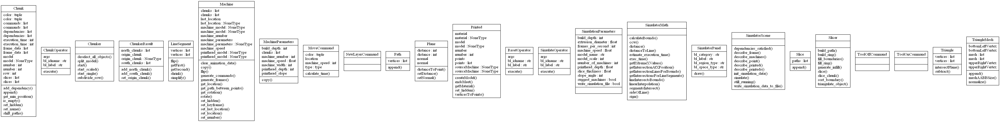

.. AM3 Chunker and Simulator documentation master file, created by
   sphinx-quickstart on Sat Sep 29 23:49:19 2018.
   You can adapt this file completely to your liking, but it should at least
   contain the root `toctree` directive.

AM3 Chunker and Simulator Library
=====================================================

.. toctree::
   :maxdepth: 2
   :caption: Contents:

   am3/am3

UML Diagram (overview)
======================

Indices and tables
==================

* :ref:`genindex`
* :ref:`modindex`
* :ref:`search`
